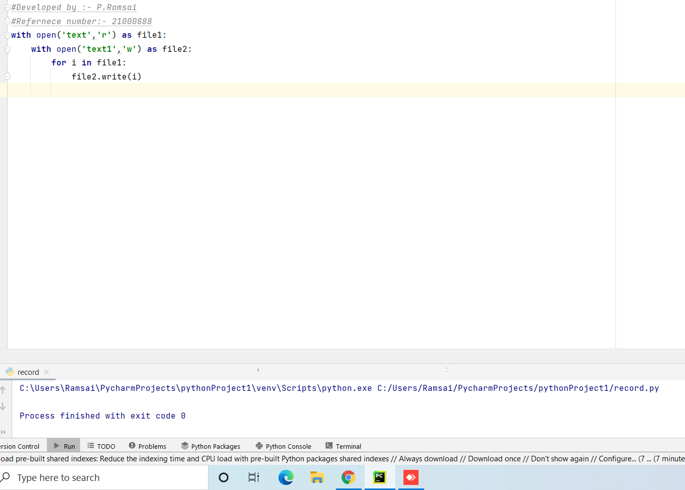
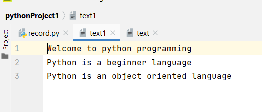
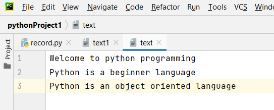

# copy-file
## AIM:
To write a python program for copying the contents from one file to another file.
## EQUIPEMENT'S REQUIRED: 
PC
Anaconda - Python 3.7
## ALGORITHM: 
### Step 1:
Start
### Step 2: 
 open the first file in read mode appropriate method 
### Step 3: 
open the second file in write mode by an appropriate method 
### Step 4:  
Loop until a variable 'i' in the first file. So variable i propagates all over the content. 
### Step 5: 
write the value of 'i' in the second file by following method.
SecondileName.write(i) 
### Step 6: 
stop
## PROGRAM:
```
~~~
#Developed by :- P.Ramsai
#Refernece number:- 21000888
~~~
with open('text','r') as file1:
    with open('text1','w') as file2:
        for i in file1:
            file2.write(i)
```


### OUTPUT:







## RESULT:
Thus the program is written to copy the contents from one file to another file.